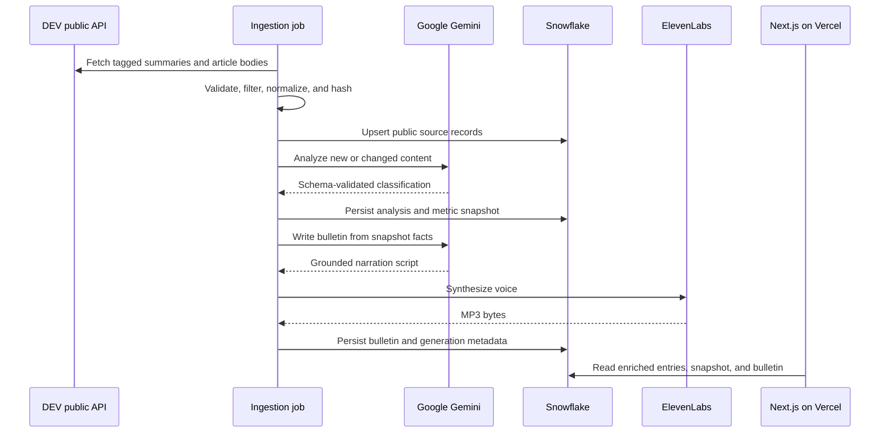

# Passion Broadcast: Build Plan and DEV Submission

## Product brief

**Question:** What does DEV care enough to build this weekend?

**Answer:** Passion Broadcast is a source-backed observatory of the public submissions to the DEV Weekend Challenge: Passion Edition. It maps recurring motivations and creative domains, keeps every interpretation tied to its source, and publishes a short narrated **State of Passion** update from the same data shown in the dashboard.

The product has two connected surfaces:

- **Passion Observatory** — the visual, filterable dashboard
- **Passion Broadcast** — the narrated field bulletin

This is deliberately not a project ranker, winner predictor, or generic article scraper.

## Why this fits the prompt

The challenge invites any interpretation of passion: rivalry, craft, fandom, love, obsession, team spirit, or something more personal. This project looks across those interpretations and asks what the community collectively chose to care about with its limited weekend.

That creates a direct link to the theme while giving the sponsor technologies real jobs. Snowflake preserves the changing field, Gemini turns unstructured stories into a constrained analytical layer, and ElevenLabs makes the snapshot listenable.

Official challenge facts used by the product:

- Launch: July 10, 2026 at 02:00 UTC
- Submission deadline: July 13, 2026 at 06:59 UTC
- Required participation tag: `#weekendchallenge`
- Optional categories pursued: Best Use of Snowflake, Best Use of Google AI, and Best Use of ElevenLabs
- The official DEV Team announcement is excluded from participant analysis

Source: [DEV Weekend Challenge: Passion Edition](https://dev.to/devteam/join-our-dev-weekend-challenge-passion-edition-1000-in-prizes-across-five-winners-submissions-10j5)

## Scope

### Must ship

- Windowed ingestion from the public DEV/Forem API
- Validated, normalized source records with stable content hashes
- Evidence-bound Gemini analysis with structured output
- Snowflake storage for source data, analyses, runs, snapshots, and broadcasts
- Responsive observatory with visible freshness and source links
- One current, approximately 45–60 second narrated bulletin
- Protected ingestion, server-only provider credentials, and sanitized errors
- Tests, production build, Vercel deployment, README, and DEV submission

### Explicit non-goals

- No author profiling or sensitive-trait inference
- No project score, ranking, endorsement, or winner prediction
- No writes to DEV and no DEV login
- No Solana integration added only to collect another category
- No claim that the dataset is an official challenge registry

## Data and AI contract

### 1. Ingest public challenge posts

Fetch articles tagged `weekendchallenge`, retain posts published inside the inclusive official window, exclude the official `devteam` announcement, and fetch article details with bounded concurrency. Normalize tags, dates, text, authorship, engagement counts, reading time, images, and source URLs.

A content hash makes updates idempotent and allows expensive analysis to be repeated only when source content changes.

### 2. Analyze the article, not the person

Gemini returns schema-validated JSON with:

- archetype
- domain
- motivation
- emotional tone
- named technologies
- sponsor technologies
- grounded summary
- confidence

The permitted archetypes are broad by design: Building & Coding, Competition, Creative Craft, Community, Family & Legacy, Fandom, Self-Improvement, and Exploration.

The prompt prohibits invented capabilities, sensitive inference, quality judgments, rankings, and winner predictions. Weak evidence should lower confidence rather than produce a stronger story.

### 3. Keep Snowflake as the source of truth

Persist normalized source records separately from model interpretations. Record ingestion runs and immutable metric snapshots so the visible state can be explained and reproduced. Store the generated bulletin beside its source snapshot and model metadata.

### 4. Serve one coherent read model

The dashboard should expose:

- entries, builders, reactions, and represented archetypes
- analysis coverage and last source refresh
- a filterable constellation of entries
- selected-entry source, summary, motivation, tone, and technologies
- archetype, technology, and publishing-time distributions
- a source-linked entry list
- the latest State of Passion transcript and audio

Production must not silently fall back to unlabeled sample data.

### 5. Generate the bulletin from stored facts

Gemini receives only the current Snowflake snapshot and writes one continuous, public-radio-style script. ElevenLabs converts that script to MP3. The result should describe patterns without pretending to be exhaustive, ranking projects, or inventing statistics.

## Architecture



## Build sequence and verification gates

### Phase 1 — source foundation

Build the Next.js application shell, strict environment validation, DEV API client, challenge-window filters, data normalization, hashing, and fixture-backed tests.

**Gate:** eligible posts are deterministic; invalid API data fails clearly; official and out-of-window posts are excluded; secrets never enter the client bundle.

### Phase 2 — intelligence and warehouse

Create the Gemini structured schemas, Snowflake connection and schema bootstrap, changed-entry analysis, transactional upserts, run logging, and dashboard snapshot builder.

**Gate:** RSA service-user smoke query succeeds; repeated ingestion is idempotent; changed content is reanalyzed; stored rows retain source and model provenance.

### Phase 3 — observatory and broadcast

Connect the dashboard to its Snowflake read model, finish responsive interactions, generate the State of Passion script, synthesize its audio, and serve the latest stored broadcast.

**Gate:** every visible entry opens its DEV source; filters and detail state work on desktop and mobile; the displayed metrics match the stored snapshot; audio and transcript describe the same facts.

### Phase 4 — release

Run unit tests, typecheck, lint, production build, database and provider smoke tests, live ingestion, visual QA, secret scan, Vercel deployment, deployed smoke checks, screenshots, and submission proofreading.

**Gate:** the live app has a current timestamp, real source links, a playable bulletin, no exposed secrets, no unlabeled fixture data, and no invented metrics in the submission.

## Release checklist

- [ ] `npm test`
- [ ] `npm run typecheck`
- [ ] `npm run lint`
- [ ] `npm run build`
- [ ] `npm run db:smoke`
- [ ] `npm run providers:smoke` with disposable test credentials
- [ ] `npm run ingest` against the live public dataset
- [ ] Verify Snowflake row counts and latest successful ingestion run
- [ ] Check desktop and mobile against the design references
- [ ] Verify source links, filters, freshness, transcript, and MP3 response
- [ ] Confirm `.env.local`, `.secrets/`, and credentials are absent from Git history
- [ ] Deploy to Vercel using `SNOWFLAKE_PRIVATE_KEY_B64`
- [ ] Add the real demo URL, cover image, screenshot/GIF, and final verified facts below
- [ ] Publish with `devchallenge` and `weekendchallenge`

## Risks and limits

| Risk | Response |
|---|---|
| DEV content or counts change | Store source timestamps and metric snapshots; show freshness in the UI |
| A post is missed or incorrectly included | Validate the official time window and tag, link to every source, and avoid completeness claims |
| AI output overreaches | Constrain the schema and prompt, expose confidence, and classify content rather than people |
| Provider failure blocks refresh | Record a sanitized failed run and keep the last successful snapshot available |
| Serverless filesystem loses audio or keys | Store durable output in Snowflake and pass the RSA key through a protected Vercel variable |
| Sponsor tech feels ornamental | Make Snowflake the read source, Gemini the analytical contract, and ElevenLabs the product's audio surface |
| Private credentials leak | Keep all provider calls server-side, ignore local secrets, and rotate disposable keys after testing |

## DEV submission draft

Replace every square-bracket placeholder and verify all statements against the deployed build before publishing.

```markdown
---
title: "Passion Broadcast: What Does DEV Care Enough to Build This Weekend?"
published: false
description: "A source-backed observatory and narrated field report for DEV Weekend Challenge: Passion Edition."
tags: devchallenge, weekendchallenge, snowflake, ai
---

<!-- Add the final cover image in the DEV editor before publishing. -->

*This is a submission for [Weekend Challenge: Passion Edition](https://dev.to/challenges/weekend-2026-07-09).*

## What I Built

Most challenge dashboards answer “how many?” I wanted to ask a more human question: **what do these projects reveal about what people care enough to spend their weekend building?**

Passion Broadcast is a live, source-backed observatory of public Passion Edition submissions. Its visual side, the **Passion Observatory**, maps entries by broad passion archetype and lets you explore their stated motivations, emotional tone, technologies, and original DEV posts. Its audio side turns the current snapshot into a short **State of Passion** field bulletin.

It is not a leaderboard. It does not score projects or predict winners. The goal is to make the shape of the community visible while keeping every interpretation connected to its source.

In the app you can:

- explore a constellation of challenge entries
- filter by archetype and technology
- open a source-backed entry summary and its original DEV post
- see the current archetype, technology, and publishing-time distributions
- check analysis coverage and data freshness
- read or listen to the latest State of Passion bulletin

## Demo

**Live app:** [ADD VERCEL URL]

**Video or GIF:** [ADD SHORT DEMO]

Suggested path through the demo: choose a node in the passion map, follow its source link, filter the field, then play the bulletin at the bottom of the page.

<!-- Add one final dashboard screenshot here. -->

## Code



Repository: https://github.com/UmutKorkmaz/passion-broadcast

## How I Built It

The pipeline starts with the public DEV API. It reads posts tagged `weekendchallenge`, applies the official July 10–13 UTC submission window, excludes the DEV Team announcement, fetches each public article body, normalizes it, and creates a stable content hash.

That hash matters because the next step calls **Google Gemini**. New or edited posts receive a schema-constrained classification: a broad passion archetype, domain, motivation, emotional tone, named technologies, sponsor technologies, a grounded summary, and a confidence value. The prompt tells Gemini to stay inside the article, avoid sensitive inferences, and never judge or rank a submission.

**Snowflake** is the source of truth rather than a decorative export. It keeps public source records separate from model analysis, records ingestion runs, stores reproducible metric snapshots, and holds each generated broadcast with its source snapshot and model metadata. The Next.js dashboard reads that enriched warehouse state.

For the audio layer, Gemini receives only facts from the current stored snapshot and writes a concise public-radio-style bulletin. **ElevenLabs** turns that script into the State of Passion narration. The transcript and audio are presented together so the voice is useful, inspectable, and connected to the same facts as the dashboard.

The interface is a responsive Next.js application deployed on Vercel. I used visible source links, analysis coverage, confidence, and freshness timestamps because an AI-powered community map should show its evidence and its limits.

The hardest design choice was resisting a ranking. Challenge data naturally invites “top project” lists, but reactions are not the same thing as passion or quality. The more honest product was an observatory: show patterns, preserve the source, and let people discover one another's work.

## Prize Categories

- **Best Use of Snowflake:** the durable source of truth for normalized entries, AI analysis, ingestion provenance, metric snapshots, and generated broadcasts
- **Best Use of Google AI:** evidence-bound structured classification plus a grounded bulletin generated from stored snapshot facts
- **Best Use of ElevenLabs:** the narrated State of Passion, which turns a changing community dataset into a short, accessible listening experience

## Limits and Privacy

Passion Broadcast reads only public DEV article content and public engagement counts; it does not require a DEV login or access private profile data. The classifications are machine-generated interpretations of posts, not people, and they can be incomplete or wrong. Counts can also change after a snapshot. This is an independent challenge project, not an official DEV record or broadcast.

## What I’d Build Next

I would add snapshot comparison so listeners can hear how the field changed over the weekend, lightweight correction tools for classifications, and optional multilingual bulletins—without losing the source-first approach.
```
