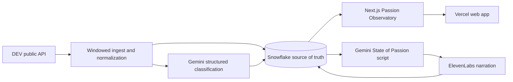

# Passion Broadcast

**What does DEV care enough to build this weekend?**

Passion Broadcast is a live, source-backed view of the projects and motivations emerging from the [DEV Weekend Challenge: Passion Edition](https://dev.to/devteam/join-our-dev-weekend-challenge-passion-edition-1000-in-prizes-across-five-winners-submissions-10j5). The visual dashboard is the **Passion Observatory**; its short narrated update is the **State of Passion** broadcast.

It is an observatory, not a leaderboard. Every entry links back to its public DEV post, and the app does not score projects or predict winners.

- Live demo: [dev-community-challange.vercel.app](https://dev-community-challange.vercel.app)
- DEV submission: **[add published post URL]**
- Source: [github.com/UmutKorkmaz/passion-broadcast](https://github.com/UmutKorkmaz/passion-broadcast)

**Status:** production deployment is live. The final challenge snapshot is refreshed from the public DEV dataset before the submission window closes.

## What it does

- Reads public posts tagged `#weekendchallenge` during the official submission window.
- Normalizes article metadata and body text, then creates a stable content hash.
- Uses Gemini structured output to identify a broad passion archetype, domain, motivation, emotional tone, named technologies, a grounded summary, and confidence.
- Stores source records, analyses, ingestion runs, metric snapshots, and generated broadcasts in Snowflake.
- Presents a filterable constellation map, source-linked entry details, distributions, timeline, analysis coverage, and visible freshness timestamps.
- Uses Gemini to write a factual 45–60 second field bulletin and ElevenLabs to narrate it.

The eight intentionally broad archetypes are Building & Coding, Competition, Creative Craft, Community, Family & Legacy, Fandom, Self-Improvement, and Exploration.

## Architecture



Snowflake owns five durable records:

- `CHALLENGE_ENTRIES` — normalized public DEV content and source metrics
- `ENTRY_ANALYSIS` — content-hash-bound Gemini output with model metadata
- `INGESTION_RUNS` — refresh status and sanitized failures
- `METRIC_SNAPSHOTS` — reproducible dashboard snapshots
- `BROADCASTS` — bulletin scripts, audio, model metadata, and timestamps

`V_ENRICHED_ENTRIES` joins the public source record to its latest analysis for the read path.

## Local setup

### Prerequisites

- Node.js 20 or newer
- A Google AI API key
- An ElevenLabs API key and voice ID
- A Snowflake account with a warehouse, database, schema, and key-pair-authenticated service user

Install the project and create a local environment file:

```bash
npm install
cp .env.example .env.local
```

Never commit `.env.local`, private keys, or generated credentials. They are ignored by Git in this repository.

### Environment variables

| Variable | Purpose |
|---|---|
| `GOOGLE_AI_API_KEY` | Gemini API key |
| `GEMINI_MODEL` | Gemini model; defaults to `gemini-3.5-flash` |
| `ELEVENLABS_API_KEY` | ElevenLabs API key |
| `ELEVENLABS_VOICE_ID` | Voice used for the bulletin |
| `ELEVENLABS_MODEL_ID` | TTS model; defaults to `eleven_multilingual_v2` |
| `SNOWFLAKE_ACCOUNT` | Snowflake account identifier |
| `SNOWFLAKE_USERNAME` | Key-pair-authenticated service user |
| `SNOWFLAKE_PRIVATE_KEY_PATH` | Local path to the RSA private key |
| `SNOWFLAKE_PRIVATE_KEY_B64` | Base64 private key for Vercel; use instead of the local path |
| `SNOWFLAKE_ROLE` | Application role |
| `SNOWFLAKE_WAREHOUSE` | Compute warehouse |
| `SNOWFLAKE_DATABASE` | Application database |
| `SNOWFLAKE_SCHEMA` | Application schema |
| `INGEST_SECRET` | Long secret for protected ingestion |
| `CRON_SECRET` | Long secret for scheduled refreshes |

At least one Snowflake private-key variable must be set. Use `SNOWFLAKE_PRIVATE_KEY_PATH` locally and `SNOWFLAKE_PRIVATE_KEY_B64` on Vercel.

### Run and verify

```bash
npm run db:smoke
npm run providers:smoke
npm run ingest
npm run dev
```

Open [http://localhost:3000](http://localhost:3000). The provider smoke and ingestion commands call paid or quota-limited APIs and may generate audio.

Before release:

```bash
npm test
npm run typecheck
npm run lint
npm run build
```

## Deploying to Vercel

1. Import `UmutKorkmaz/passion-broadcast` into Vercel.
2. Add every variable from `.env.example` to the appropriate Vercel environments.
3. Base64-encode the Snowflake private key into `SNOWFLAKE_PRIVATE_KEY_B64`; a local file path is not available in a Vercel function.
4. Deploy only after the test, typecheck, lint, and production-build gates pass.
5. Run ingestion from a trusted environment, then verify the dashboard timestamp, source links, and latest audio response on the deployed app.
6. Replace the live-demo placeholder above and in the DEV submission draft.

## Automated challenge refresh

`.github/workflows/refresh-passion-broadcast.yml` runs the ingestion pipeline during the final challenge hours and once after the deadline. Each run checks the public DEV dataset and records a Snowflake snapshot. Gemini and ElevenLabs are invoked only when a qualifying post is new or edited; unchanged runs do not generate another broadcast. The workflow can also be started manually from GitHub Actions.

Provider and Snowflake credentials are stored as encrypted GitHub Actions secrets. The pipeline runs on the GitHub runner rather than inside a Vercel request so a full refresh is not constrained by the serverless request timeout. Scheduled runs are intentionally limited to the 2026 challenge window so the judged dataset freezes after the final capture.

## Privacy and limitations

- The source is public DEV article content and public engagement counts. The app does not require a DEV login or read private profile data.
- Gemini is instructed to classify the article, not the author. It must not infer sensitive traits, judge quality, rank entries, or predict winners.
- Classifications and summaries are machine-generated and can be incomplete or wrong. Confidence, source links, analysis coverage, and timestamps keep that uncertainty visible.
- DEV posts and reaction counts can change. A dashboard snapshot is a time-bounded view, not an official or exhaustive challenge record.
- The bulletin is AI-written and AI-narrated from the stored snapshot; it is not an official DEV broadcast.

## Challenge fit

Passion Broadcast turns the prompt back toward the community: instead of building one more artifact about a single passion, it maps the passions people chose to spend their weekend building. It targets three optional prize categories with distinct responsibilities:

- **Snowflake** is the source of truth and reproducibility layer.
- **Google AI** converts varied prose into constrained, evidence-bound structured data and a grounded bulletin script.
- **ElevenLabs** turns the current field snapshot into an accessible, listenable community update.

The full build plan and copy-ready submission draft are in [PROJECT_PLAN_AND_SUBMISSION.md](./PROJECT_PLAN_AND_SUBMISSION.md).
